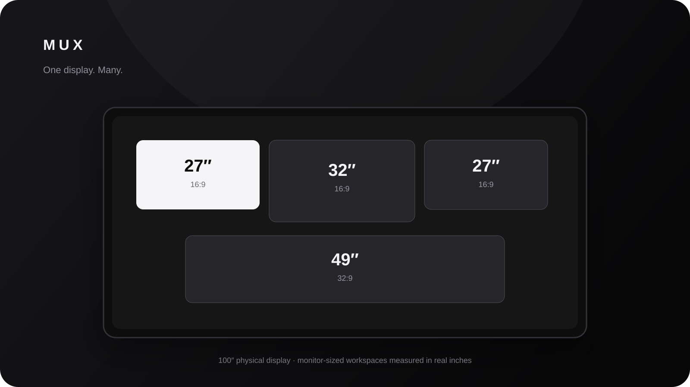
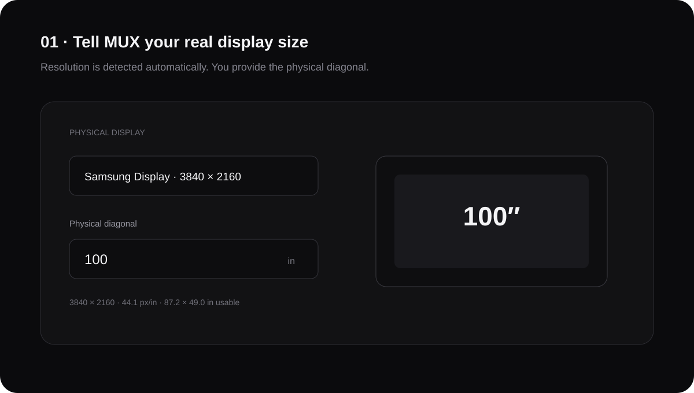
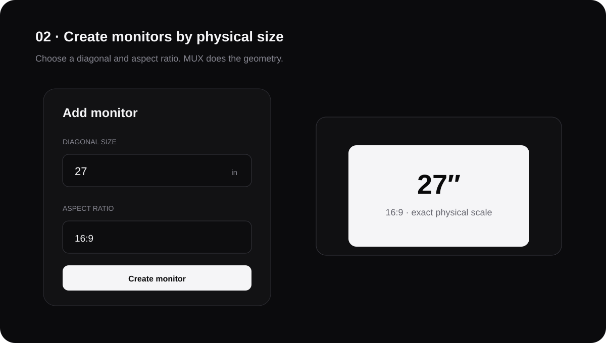
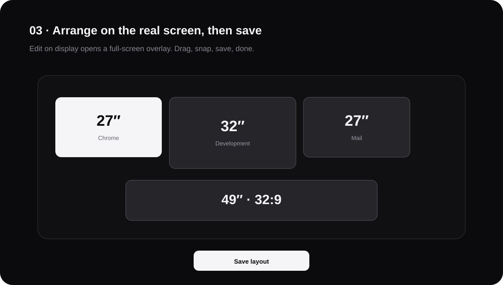

<div align="center">
  

  # MUX

  **One display. Many.**

  Turn a large Windows display into monitor-sized workspaces measured in real physical inches.

  <br />

  <a href="https://github.com/TripleAxisCapital/MUX/releases/download/latest-build/MUX-win-x64.zip">
    
  </a>

  <br />
  <sub>Windows 10/11 · x64 · self-contained · no separate .NET install required</sub>
  <br />
  <sub><a href="https://github.com/TripleAxisCapital/MUX/releases/tag/latest-build">View latest build details</a></sub>

  <br /><br />
  
</div>

## What MUX does

MUX is a native Windows workspace manager for unusually large displays, TVs, projectors, ultrawides, and wall-sized panels.

Instead of dividing a screen into arbitrary percentages, MUX starts with **physical size**. Tell MUX that your real display is 100 inches, 80 inches, 55 inches, or any other size. Then create a 24", 27", 32", 49" ultrawide, or custom monitor. MUX converts those dimensions into the exact pixel footprint required on that physical panel.

Arrange the monitors directly on the full-size display, save the layout, and let MUX manage normal Windows applications inside those regions.

### Why the name MUX?

**MUX** comes from **multiplexer** — engineering terminology for coordinating multiple channels through shared infrastructure. MUX applies that idea to screen space: one physical display becomes the shared surface for multiple logical workspaces.

The name is intentionally short, technical, and functional: **one display, many workspaces**.

> MUX v0.1 uses the managed-monitor architecture: Windows still sees the underlying physical panel as one display, while MUX manages monitor-like regions above it. No custom display driver is required.

---

## Three steps

### 1. Tell MUX how large the real display is

MUX detects the Windows resolution and display position automatically. You enter the physical diagonal.



For unusual panels, TVs with inaccurate EDID data, or installations where millimetre-level accuracy matters, select **Calibrate with ruler**. MUX displays a 10-inch reference line. Measure it, enter the measured length, and MUX corrects its physical pixel scale.

### 2. Create the monitor you want

Choose a physical diagonal and aspect ratio. MUX handles the geometry.



Included aspect ratios:

- 16:9
- 16:10
- 21:9
- 32:9
- 4:3
- 3:2

Monitor positions and sizes are stored in **inches**, not screen percentages. A saved 27" monitor remains a 27" monitor when MUX recalculates the layout.

### 3. Arrange it on the real display

Select **Edit on display**. MUX opens a full-display editing surface on the selected physical screen. Every monitor is shown at its calibrated physical size.



Drag the workspaces wherever you want. Edges magnetically align. Select **Save layout** and the editing surface disappears.

---

## Daily use

MUX stays active in the Windows system tray. Optional black monitor outlines remain visible when enabled, so empty virtual monitors are still clearly defined without intercepting mouse input.

| Action | Behavior |
|---|---|
| Maximize a normal application | MUX converts the maximize into a monitor-sized maximize for the region containing that window |
| Maximize it again | MUX restores the application's previous bounds |
| Show monitor outlines | Keep click-through black borders visible around empty or occupied MUX monitors |
| `Ctrl + Alt + M` | Maximize / restore the foreground window inside its current MUX monitor |
| `Ctrl + Alt + ←` | Move the foreground window to the previous MUX monitor |
| `Ctrl + Alt + →` | Move the foreground window to the next MUX monitor |
| Hold `Shift` while finishing a drag | Snap the dragged application to the MUX monitor beneath it |
| `Ctrl + Alt + E` | Open the full-display layout editor |
| Close the MUX window | Keep the engine active in the system tray |

Create as many named layouts as you need — **Work**, **Trading**, **Development**, **Studio**, or anything else — and switch between them from the sidebar.

---

## Download

The button at the top of this README always points to the rolling Windows x64 build from `main`:

**[Download MUX for Windows](https://github.com/TripleAxisCapital/MUX/releases/download/latest-build/MUX-win-x64.zip)**

GitHub Actions only refreshes this download after the Windows project builds and packages successfully. The release is self-contained, so users do not need to install the .NET runtime separately.

---

## Physical sizing

MUX uses the diagonal pixel count of the physical display to establish its initial pixel density:

```text
pixels per inch = √(width² + height²) / physical diagonal
```

For a 3840 × 2160 panel identified as 100 inches, MUX calculates roughly 44.1 pixels per inch. A 27" 16:9 workspace is therefore rendered at approximately 1037 × 583 physical pixels.

Calibration applies a correction factor on top of that calculation. This is why MUX can work with a 100" television, an 80" panel, a 49" ultrawide, or a conventional desktop monitor without hard-coded layouts.

---

## Architecture

MUX is deliberately split into two layers:

```text
MUX.Core
  Physical geometry
  Inches ↔ pixels
  Layout models
  Zone selection

MUX.App
  WPF / .NET 10 desktop UI
  Full-display editor
  Win32 display discovery
  WinEvent window tracking
  Window positioning
  Global hotkeys
  Tray lifecycle
  JSON persistence
```

The application targets **.NET 10 LTS** and Windows x64. The published build is self-contained, so end users do not need to install a separate .NET runtime.

See [Architecture](docs/ARCHITECTURE.md) for the detailed event flow and design decisions.

---

## Build MUX

### Requirements

- Windows 10 version 2004 (build 19041) or later
- Windows 11 recommended
- Visual Studio 2026 with **.NET desktop development**, or the .NET 10 SDK

### One command

```powershell
./scripts/build.ps1
```

The script validates the geometry engine, builds the Windows application, publishes a self-contained x64 build, and creates:

```text
artifacts/MUX-win-x64.zip
```

Or build manually:

```powershell
dotnet restore MUX.sln
dotnet run --project tests/MUX.Core.Tests/MUX.Core.Tests.csproj -c Release
dotnet build src/MUX.App/MUX.App.csproj -c Release
dotnet publish src/MUX.App/MUX.App.csproj -c Release -r win-x64 --self-contained true -o artifacts/MUX
```

Every push to `main` runs Linux geometry validation and a real Windows x64 build in GitHub Actions. After a successful `main` build, CI also refreshes the stable `latest-build` GitHub Release used by the README download button.

---

## Where MUX stores settings

MUX keeps configuration local to the machine:

```text
%LOCALAPPDATA%\MUX\state.json
```

No account is required. The current application contains no telemetry, analytics SDK, cloud synchronization, or network service.

---

## Current V0.1 limitations

MUX v0.1 intentionally uses **managed monitor regions** rather than a virtual display driver.

That means:

- Windows Display Settings still sees the original physical display.
- Normal desktop applications are the primary target.
- Exclusive-fullscreen games and applications that bypass normal top-level Windows positioning may ignore MUX.
- Some protected or unusual application windows may reject external positioning.
- MUX must remain running for managed monitor behavior to remain active.

This architecture keeps installation simple and failure-safe: if MUX exits, the physical display immediately continues behaving like a normal Windows display.

A future **MUX Native** mode can add true Windows virtual displays without changing the physical geometry or layout format used by MUX.Core.

---

## Troubleshooting

Start with [Troubleshooting](docs/TROUBLESHOOTING.md) for calibration, maximize, DPI, multi-display, and startup guidance.

---

<div align="center">
  <strong>MUX</strong><br />
  <sub>One display. Many.</sub>
</div>
